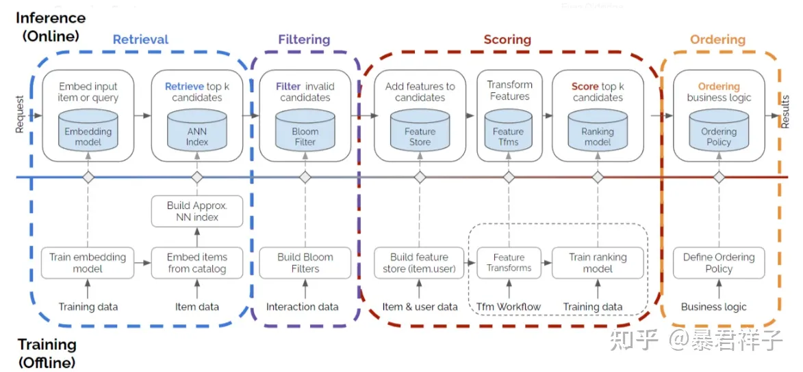

# 推荐系统 (pytorch version)


## 1 __项目目标__
搭建一个完备的


---

## 2 **sgd_rec_sys主要内容**
* 王树森（王老师） [推荐系统系列课程](https://space.bilibili.com/1369507485/channel/collectiondetail?sid=615109)为主要系统框架
* 推荐方向最新论文的整合
* [cs329-实用机器学习](https://space.bilibili.com/1567748478/channel/collectiondetail?sid=28144)-李沐（沐导）中的一些工程实践
    
---

## 3 推荐相关论文汇总

[docs/paper.md](./docs/papers.md)

---
## 4 各模块细节

## 4.1 召回(retrieval)
```
主流方法：
    基于向量召回，模型输出的user_emb, item_emb存储在向量数据库中，使用最近邻查找快速从底层库中取出。


其他召回：
    地理位置召回(无个性化)：
        • GeoHash：对经纬度的编码，地图上⼀个长⽅形区域。
        • 索引：GeoHash->优质笔记列表（按时间倒排）
    
    同城召回（无个性化）：
        • 索引：城市->优质笔记列表（按时间倒排）
    
    关注(or有交互)作者召回：
        ⽤户->关注(or有交互)的作者->最新的笔记
    
    相似作者召回：
        ⽤户->感兴趣的作者->相似作者->最新的笔记

    缓存召回：
        精排前50，但是没有曝光的，缓存起来，作为⼀条召回通道。
        需要设计缓存退场机制
            • ⼀旦笔记成功曝光，就从缓存退场。
            • RLU：如果超出缓存⼤⼩，就移除最先进⼊缓存的笔记。
            • cache次数-笔记最多被召回10次，达到10次就退场。
            • cache时间-每篇笔记最多保存3天，达到3天就退场。

    


过时方法（低算力时代的方法）：


```


## 4.2 排序(rank)
```


```

## 4.3 特征交叉(feature cross)
```

```

## 4.4 行为序列() 
```
```

## 4.5 重排(reorder)
```
物品多样性（物品漏斗中的相似度度量）：
    1、物品属性标签
        每个物品有n级标签，通过标签计算相似度。
        这种方法比较简单，标签也可以用模型离线计算。
    2、 item embedding
        利用clip计算出的item的图文emb
        使用mmr或dpp等不同的向量度量标准来选取物品
         -同时考虑item reward & 向量相似度
        
```

## 4.6 物品冷启动(cold start)
```

```

## 4.7 模型指标(metrics)
* accuracy、precision、recall、f1
* roc、auc
* 参考文档 [[docs/mertics]](./docs/metrics/index.md)

## 4.8 A/B测试
* 同层实验互斥、不同层正交
* Holdout 机制（纯净流量）
  * 部门整体策略收益
* 反向对照实验（推全后开关关闭的实验）
  * 用于长期观察实验指标


---
## 5 其他

### 5.1 文档自动生成生成
```
TODO:
    python-sphinex

```


5.2 相关术语



