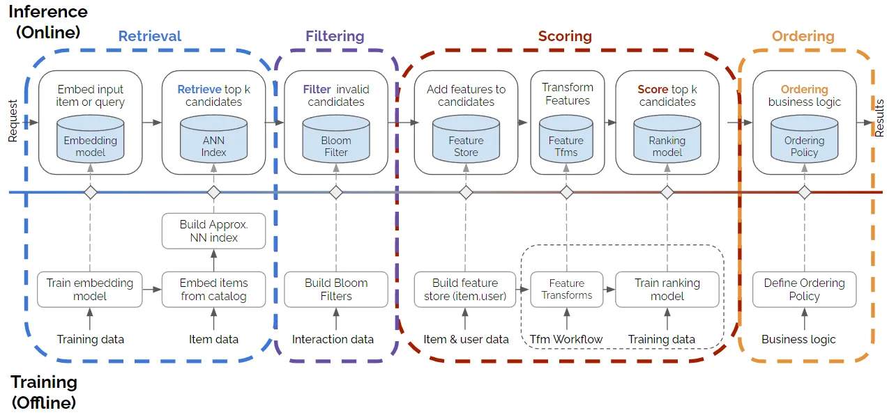

# sgd_rec_sys V_0.1  (pytorch)

## 1 项目目标
搭建一个完整可用的推荐系统，模块化实现推荐各阶段常用模型和算法。

进度：
  - 相关论文大致实现了一遍，忽略了不少细节。
  - 文档待整理完善
  - 框架需要抽象，还做不到组合即用
    - 编码层需要统一抽象处理

参考:
* 王树森[推荐系统系列课程](https://space.bilibili.com/1369507485/channel/collectiondetail?sid=615109)为主要系统框架
* [cs329-实用机器学习](https://space.bilibili.com/1567748478/channel/collectiondetail?sid=28144)-李沐-一些工程实践
* 推荐方向最新论文的整合

---

## 2 sgd_rec_sys主要内容

本代码库包含三个主要部分：
* [./python/sgd_rec_sys](./python/sgd_rec_sys/): src目录
* [./apps](./apps/): 算法模型的使用方法请参考各模块中的jupyter_notebook
* [./docs](./docs/) 针对某些具体算法、工程问题做展开介绍。 
* 相关论文 [papers.md](./papers.md)

---

## 3 实现进度
- retrieval
  - [X] Item CF
  - [X] User CF
  - [X] swing
  - [X] MF (矩阵分解) 
  - [ ] DSSM (双塔模型)
  - [ ] Deep Retrieval
    - 搞懂设计思路，模型本身没意思
  - [ ] 其他召回通道
    - [ ] GeoHahs
      - GeoHash：对经纬度的编码，地图上⼀个长⽅形区域
      - 索引：GeoHash->优质笔记列表（按时间倒排）
    - [ ] 同城召回
      - 索引：城市->优质笔记列表（按时间倒排）
    - [ ] 关注作者召回
      - ⽤户->关注的作者->最新的笔记
    - [ ] 有交互的作者召回
      - ⽤户->有交互的作者->最新的笔记
    - [ ] 相似作者召回
      - ⽤户->感兴趣的作者->相似作者->最新的笔记
    - [ ] 缓存召回
      - 精排前50，但是没有曝光的，缓存起来，作为⼀条召回通道。
      - 缓存⼤⼩固定，需要退场机制。
        - 召回次数、保存天数、FIFO、曝光退场

- filter
  - [X] 曝光过滤 & Bloom Filter
  
- rank
  - [ ] 多目标建模
  - [ ] MMOE
  - [X] 融合预估分数
  - [ ] Youtube 视频播放建模
  - [ ] 排序模型特征
  - [ ] 粗排三塔
  - [ ] google Deep and Wide (概念模型pass)
    - 基于特征工程的LR+DNN并行

- cross
  - FM
    - [X] FM
    - [X] DeepFM
    - [ ] xDeepFM (太丑了pass)

  - Deep & Cross
    - [X] DCN V1
      - cross layer模型容量小
    - [X] DCN V2
  
  - LHUC
    - [X] PPNet (快手)

  - field 交叉
    - [X] FiBinet 
      - SENet + Bilinear Cross
      - 矩阵实现Bilinear略费劲

- lastn
  - [X] DIN
  - [ ] SIM (工程细节偏多)
  
- rerank
  - [X] MMR 
    - Candi->Saved 贪心找max unsimilar item
  - [X] DPP
    - det^2 衡量相似度
  - [ ] MGS
    - 施密特正交法找基向量，类DPP

- cold start
  - 召回通道
    - 修正双塔召回
    - 类目(关键词)召回
      - 用户->类目(关键词)偏好分布
      - 类目(关键词)->笔记列表（按时间倒排）
    - 聚类召回
      - 图文向量-> kmeans聚类
    - look alike
      - 新笔记->有交互用户->相似用户扩散（user-cf，用户向量余弦）
      - 种子用户emb均值->新笔记特征，最近邻查找匹配新用户
    - 流量调控
      - 提权（易过曝、欠曝）、保量

- metrics
  - [X] accuracy、precision、recall、f1
  - [X] AUC_ROC ([原理](./docs/metrics/index.md))
---
## 4 各模块细节
todo 准备移到docs里， 相关论文读后感也放到各自类目下
准备一个简单的总读论文的列表，方便他人参考

### 4.1 召回(retrieval)
```
主流方法：
    基于向量召回，模型输出的user_emb, item_emb存储在向量数据库中，使用最近邻查找快速从底层库中取出。

基于协同过滤的召回：
    item cf
    user cf
    swing

其他召回：
    地理位置召回(无个性化)：
        • GeoHash：对经纬度的编码，地图上⼀个长⽅形区域。
        • 索引：GeoHash->优质笔记列表（按时间倒排）
    
    同城召回（无个性化）：
        • 索引：城市->优质笔记列表（按时间倒排）
    
    关注(or有交互)作者召回：
        ⽤户->关注(or有交互)的作者->最新的笔记
    
    相似作者召回：
        ⽤户->感兴趣的作者->相似作者->最新的笔记

    缓存召回：
        精排前50，但是没有曝光的，缓存起来，作为⼀条召回通道。
        需要设计缓存退场机制
            • ⼀旦笔记成功曝光，就从缓存退场。
            • RLU：如果超出缓存⼤⼩，就移除最先进⼊缓存的笔记。
            • cache次数-笔记最多被召回10次，达到10次就退场。
            • cache时间-每篇笔记最多保存3天，达到3天就退场。

改进召回模型
  • 双塔模型：优化正负样本、改进神经⽹络结构、改进训练的⽅法。
  • I2I模型：同时使⽤ItemCF 及其变体、使⽤物品向量表征计算物品相似度。
  • 添加⼩众的召回模型，⽐如PDN、Deep Retrieval、SINE、M2GRL 等模型。
  • 在召回总量不变的前提下，调整各召回通道的配额。（可以让各⽤户群体⽤不同的配额。）

  过时方法（低算力时代的方法）：

```

### 4.2 排序(rank)
```


```

### 4.3 特征交叉(feature cross)
```

```

### 4.4 行为序列() 
```
```

### 4.5 重排(reorder)
```
物品多样性（物品漏斗中的相似度度量）：
    1、物品属性标签
        每个物品有n级标签，通过标签计算相似度。
        这种方法比较简单，标签也可以用模型离线计算。
    2、 item embedding
        利用clip计算出的item的图文emb
        使用mmr或dpp等不同的向量度量标准来选取物品
         -同时考虑item reward & 向量相似度
        
```

### 4.6 物品冷启动(cold start)
```

```

### 4.7 模型指标(metrics)
* accuracy、precision、recall、f1
* roc、auc
* 参考文档 [[docs/mertics]](./docs/metrics/index.md)

### 4.8 A/B测试
* 同层实验互斥、不同层正交
* Holdout 机制（纯净流量）
  * 部门整体策略收益
* 反向对照实验（推全后开关关闭的实验）
  * 用于长期观察实验指标


---
## 5 其他

### 5.1 文档自动生成生成
```
TODO:
    python-sphinex

```


5.2 相关术语



| Tables   |      Are      |  Cool |
|----------|:-------------:|------:|
| col 1 is |  left-aligned | $1600 |
| col 2 is |    centered   |   $12 |
| col 3 is | right-aligned |    $1 |


## todo
- 学到了一个新操作 torch.einsum(equation, *operands)
  - fibnet里的那些复杂操作可以进一步简化api了
- multi-hot的定长批处理实现的比较丑


