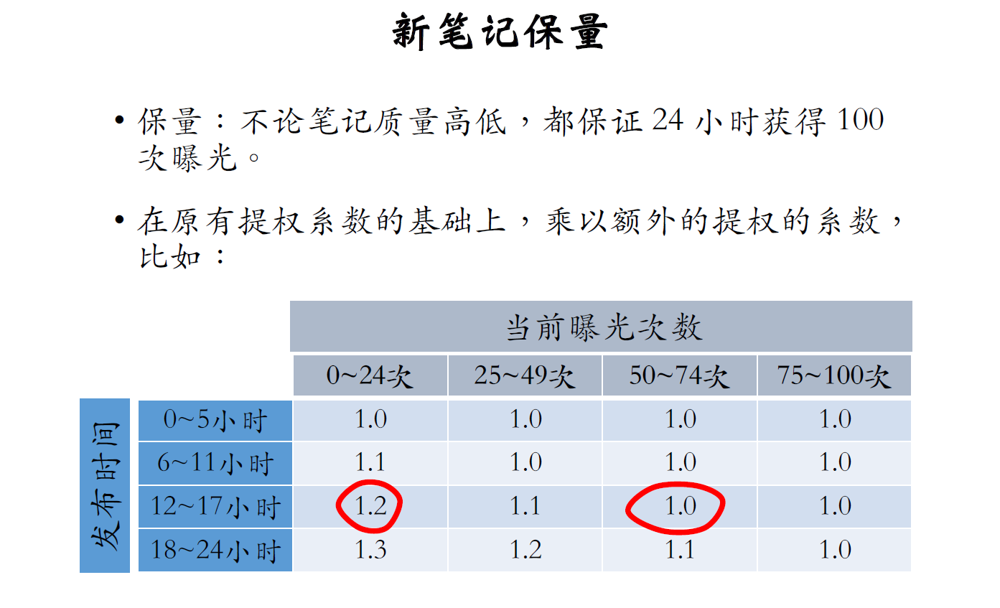

# 物品冷启动

UGC新发布物品冷启问题
* 新笔记`缺少`与⽤户的`交互`，导致推荐的难度⼤、效果差。
* 扶持新发布、低曝光的笔记，可以`增强`作者`发布意愿`。

优化冷启的目标
* `精准推荐`：克服冷启的困难，把新笔记推荐给合适的⽤户，不引起⽤户反感。
* `激励发布`：流量向低曝光新笔记倾斜，激励作者发布。
* `挖掘⾼潜`：通过初期⼩流量的试探，找到⾼质量的笔记，给与流量倾斜。

Content
- 召回通道
  - 修正双塔召回
  - 类目、关键词召回
  - 聚类召回
  - look alike
- 流量调控

---
## 1 评价指标

作者侧指标
* `发布渗透率` = 当⽇发布⼈数/⽇活⼈数
* `人均发布量` = 当⽇发布笔记数/ ⽇活⼈数

        - 发布渗透率、⼈均发布量反映出作者的发布积极性。
        - 冷启的重要优化⽬标是促进发布，增⼤内容池。
        - 新笔记获得的曝光越多，⾸次曝光和交互出现得越

用户侧指标
* 新笔记指标：新笔记的`点击率`、`交互率`。
  * 少数头部新笔记占据了⼤部分的曝光
  * 分别考察⾼曝光、低曝光新笔记。
* ⼤盘指标：消费时长、⽇活、⽉活。
  * 扶持新笔记导致`大盘消费指标变差`
  * 作者侧`发布指标变好`

内容侧指标
* `⾼热笔记占⽐`
  * 高热笔记：前30天获得1000+次点击。
  * ⾼热笔记占⽐越⾼，说明冷启阶段挖掘优质笔记
的能⼒越强。

优化方式
* `全链路优化` + `流量调控`(流量在新老物品中的分配)

---
## 2 简单的召回通道(`全链路优化`)
新物品缺失用户交互信息（点击、点赞），无有效物品id embedding。

不适用
* 无法使用itemcf、
* `双塔召回`输入的特征不全面，模型预估不准。（半适用）

适用
* `类目、关键词召回`
* `聚类召回`
* `Look-Alike召回`

`双塔的改进方式`
* 由于没有交互信息，所以没有有效的`双塔训练emb`（笔记id）
  * 使用default embedding，走召回通道（不一定能推出去）
  * 使用相似物品的emb（查找topk内容最相似的高爆物品，merge后作为初始emb）
* `多个向量召回池`
  * 1h、6h、24h、30d 新笔记
  * 共享同一个双塔召回（提高新笔记的曝光概率）

`类目召回`
* 用户感兴趣的`类目`、`关键词`
  * 用户画像->类目->笔记list（按时间倒排）
  * 用户画像->关键词->笔记list（按时间倒排）
  
    缺点：
    * 时效性强，如何维护新笔记list是个考虑（发布冲突被覆盖后，不一定会被召回）
    * 弱个性化，不够精准（如果笔记质量差影响用户体验）

---
## 3 聚类召回(`全链路优化`)
优化思路：如果⽤户喜欢⼀篇笔记，那么他会喜欢内容相似的笔记。

* 训练⼀个神经⽹络，基于笔记的类⽬和图⽂内容，把笔记映射到向量。
    * 对比学习，类似word2vec的思路训练相似物品emb
* 把物品按照向量聚类成K类
* 对于新物品使用模型编码并建立映射关系
  * cluster-> 新物品id（by时序）
* 用户历史中抽最近M个喜欢的物品，找到对应的cluster，并召回N篇最新的笔记。共召回M*N篇新笔记

模型训练问题（对比学习）
  * 正样本的选取
    * 人工标注+自动筛选
    * 高曝光物品交互信息充足，相对可靠
    * 相同的二级类目
    * itemcf选相似样本
  * 负样本的选取
    * 全体笔记随机抽取
    * 高质量笔记，避免图文无关
    * 字数较多的笔记

---
## 4 Look-Alike人群扩散(`全链路优化`)
优化思路：两用户相似，一个用户喜欢新物品，那么另一个用户也大概率喜欢该物品

种子用户  --人群扩散--> Look-Alike人群

计算两用户间的相似度
* UserCF
* Embedding

Look-Alike⽤于新笔记召回
* 点击、点赞、收藏、转发——⽤户对笔记可能
感兴趣。
* 把有交互的⽤户作为新笔记的种⼦⽤户。
* ⽤look-alike在相似⽤户中扩散。

step1 新笔记交互用户的向量作为笔记特征，保持短线实时更新  

step2 给用户召回新物品流量池

---
## 5 `流量调控`
扶持新笔记的目的
* 促进作者侧发布，扩大内容池
  * 新笔记曝光越多，作者创作积极性越高
  * 反映在发布渗透率和人均发布量
* 挖掘优质笔记
  * 每篇新笔记获得足够的曝光来检验质量（探索-explore）
  * 提高高热笔记占比
  
流量调控技术
* 推荐结果中强插新笔记
* 对新笔记的排序分数做`提权`（boost）
* 通过提权，对新笔记做`保量`
* `差异化保量`

`新笔记提权`

⼲涉`粗排`、`重排`环节，给新笔记提权

* 优点：容易实现，投⼊产出⽐好。
* 缺点：曝光量对提权系数很敏感，很难精确控制曝光量，容易过度曝光和不充分曝光。

`新笔记保量`

pid控制也是一种保量调控思路

保量的难点
* 保量成功率远低于100%
* 线上环境变化会导致保量失败

思考：

为了完成保量，设置过高的提权系数，会把笔记推荐给不合适的用户（影响用户体验）。导致探索出的用户侧交互指标变差，被误判定为劣质笔记，受到系统长期打压。

TODO 正确的探索方式应该是什么

`差异化保量`
* 基础保量：24⼩时100次曝光。
* 内容质量：⽤模型评价内容质量⾼低，给予额外保量⽬标，上限是加200次曝光。
* 作者质量：根据作者历史上的笔记质量，给予额外保量⽬标，上限是加200次曝光。
  
⼀篇笔记最少有100次保量，最多有500次保量。

---
## 6 AB测试

参考王树森笔记 ColdStart_06.pdf

