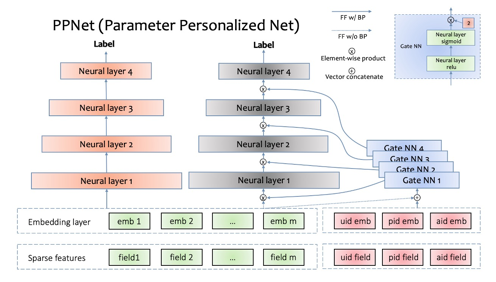

参数个性化CTR模型-PPNet
2019年之前，快手App主要以双列的瀑布流玩法为主，用户同视频的交互与点击，观看双阶段来区分。在这种形式下， CTR预估模型变得尤为关键，因为它将直接决定用户是否愿意点击展示给他们的视频。彼时业界主流的推荐模型还是以DNN，DeepFM等简单的全连接深度学习模型为主。但考虑到某用户个体和视频的共建语义模式在全局用户的共建语义模式基础上会有个性化的偏差，如何在DNN网络参数上为不同用户学习一个独有的个性化偏差成为了快手推荐团队优化的方向。

在语音识别领域中，2014年和2016年提出的LHUC算法(learning hidden unit contributions)核心思想是做说话人自适应(speaker adaptation)，其中一个关键突破是在DNN网络中，为每个说话人学习一个特定的隐式单位贡献(hidden unit contributions)，来提升不同说话人的语音识别效果。借鉴LHUC的思想，快手推荐团队在精排模型上展开了尝试。经过多次迭代优化，推荐团队设计出一种gating机制，可以增加DNN网络参数个性化并能够让模型快速收敛。快手把这种模型叫做PPNet(Parameter Personalized Net)。据快手介绍，PPNet于2019年全量上线后，显著的提升了模型的CTR目标预估能力。

如上图所示，PPNet的左侧是目前常见的DNN网络结构，由稀疏特征(sparse features)、嵌入层(embedding layer)、多神经网络层(neural layer)组成。右侧是PPNet特有的模块，包括Gate NN和只给Gate NN作为输入的id特征。其中uid，pid，aid分别表示user id，photo id，author id。左侧的所有特征的embedding会同这3个id特征的embedding拼接到一起作为所有Gate NN的输入。需要注意的是，左侧所有特征的embedding并不接受Gate NN的反传梯度，这样操作的目的是减少Gate NN对现有特征embedding收敛产生的影响。Gate NN的数量同左侧神经网络的层数一致，其输出同每一层神经网络的输入做element-wise product来做用户的个性化偏置。Gate NN是一个2层神经网络，其中第二层网络的激活函数是2 * sigmoid，目的是约束其输出的每一项在[0, 2]范围内，并且默认值为1。当Gate NN输出是默认值时，PPNet同左侧部分网络是等价的。经实验对比，通过Gate NN为神经网络层输入增加个性化偏置项，可以显著提升模型的目标预估能力。PPNet通过Gate NN来支持DNN网络参数的个性化能力，来提升目标的预估能力，理论上来讲，可以用到所有基于DNN模型的预估场景，如个性化推荐，广告，基于DNN的强化学习场景等。

[原文链接](https://www.51cto.com/article/644214.html)