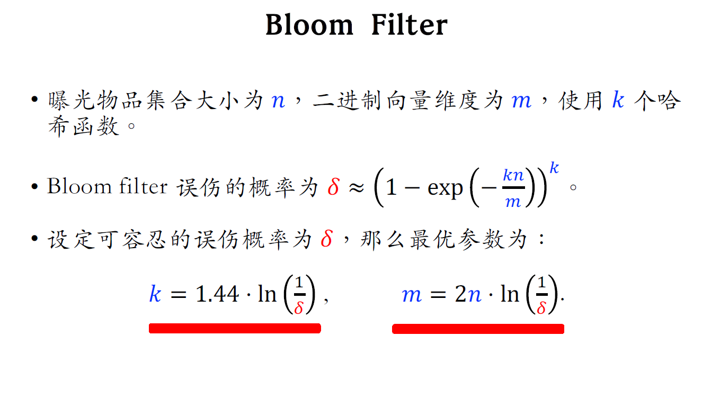
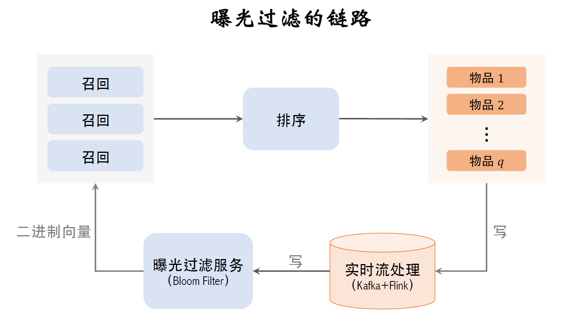

# 曝光过滤 & Bloom Filter 

## Bloom Filter 最优参数设定

## 曝光过滤链路

## 缺点和解决方案

- Bloom filter 只⽀持添加物品，不⽀持删除物品。从集
合中移除物品，无法消除它对向量的影响。
    - 每天维护一个独立的V[m]， 线上部署30天V[m]的叠加
- 每天都需要从物品集合中移除年龄⼤于1个⽉的物品。
  - 超龄物品不可能被召回，没必要把它们记录在Bloom filter，降低𝑛可以降低误伤率