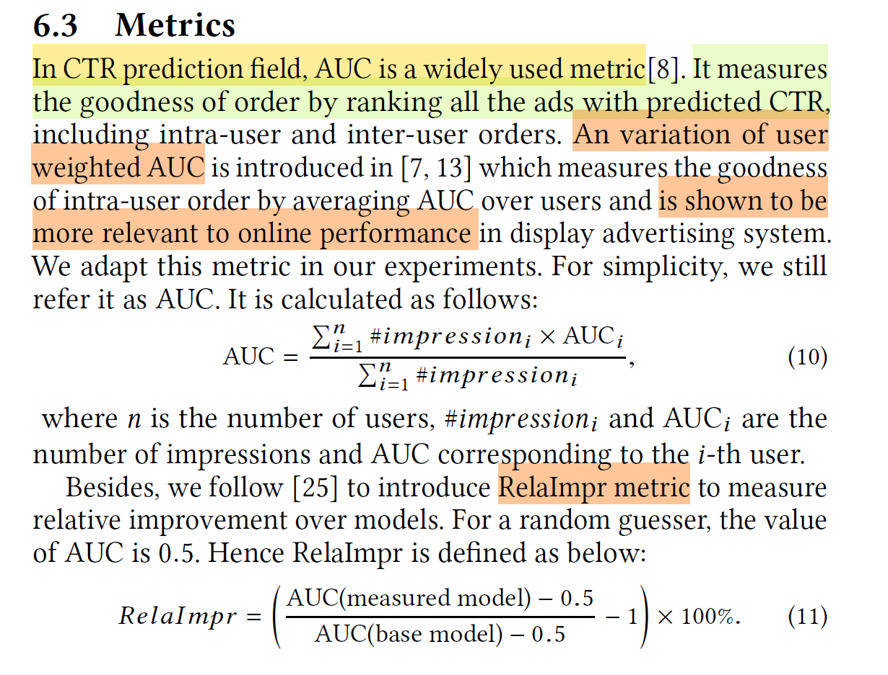

# More AUC

介绍工业界实际使用的AUC指标

---
## GAUC(Group AUC)
GAUC（Group Area Under the Curve）是一种用于评估多组数据的分类性能的指标，通常用于多分类或多标签问题。它是AUC（Area Under the Curve）的扩展，AUC通常用于二分类问题。

在多分类或多标签问题中，往往存在多个类别或标签，因此需要考虑每个类别的分类性能。GAUC通过计算多组数据的ROC曲线下面积的平均值来评估分类器的性能。

GAUC的计算步骤如下：

* 对于每个类别或标签，计算其对应的ROC曲线。
* 计算每个类别的ROC曲线下面积（AUC）。
* 将所有类别的AUC取平均值，得到GAUC。

GAUC的取值范围在0到1之间，值越接近1表示分类器的性能越好。与AUC类似，GAUC的值越高，分类器对多组数据的分类能力越强。

GAUC通常用于评估多分类器或多标签分类器的性能，`特别是在处理多类别不平衡数据时，它可以提供更全面的性能评估`。

针对线上ctr预估点击偏好问题，按照用户session来分组，计算group auc。

---
## UAUC (User-Aware AUC)

UAUC代表的是User-Aware Area Under the Curve。这是一种衡量推荐系统性能的指标，特别是在个性化推荐中。`UAUC旨在考虑用户的特定偏好和行为，而不仅仅是全局的推荐准确度。`

在推荐系统中，通常使用AUC来评估模型的排序性能，但AUC只考虑了全局的排序准确度，而没有考虑到用户的个性化偏好。UAUC则引入了用户个性化的信息，通过计算每个用户的AUC，然后取所有用户AUC的平均值来评估推荐系统的性能。

UAUC的计算流程通常如下：

* 对于每个用户，根据其历史行为和推荐结果，计算其对应的ROC曲线。
* 计算每个用户的ROC曲线下面积（AUC）。
* 取所有用户AUC的平均值，得到UAUC作为推荐系统的性能指标。
  
UAUC的引入可以更好地反映推荐系统对用户个性化需求的满足程度，是推荐系统评价指标的一种扩展。

注：PPNet 中使用的是uauc

---
## DIN-AUC 变体

在DIN（Deep Interest Network）模型中，通常会使用一种名为"Local AUC"的AUC变体来评估模型的性能。DIN是一种用于推荐系统的深度学习模型，旨在更好地捕捉用户的兴趣和行为。

在传统的AUC评估中，通常会将所有的正负样本进行混合，然后计算ROC曲线下面积。但在推荐系统中，用户的兴趣可能具有很强的局部性，即用户更可能对某些物品感兴趣，而对其他物品则不感兴趣。因此，传统的AUC评估可能无法很好地反映推荐系统的实际性能。

"Local AUC" 是一种针对用户兴趣的局部性的AUC变体，它的计算过程如下：

* 对于每个用户或每个场景，分别计算其对应的正负样本，然后计算其ROC曲线。
* 在每个用户或场景的ROC曲线上，计算对应的AUC值，即局部AUC。
* 最后，将所有用户或场景的局部AUC取平均值，得到"Local AUC"作为评估推荐系统性能的指标。

通过"Local AUC"，可以更好地评估推荐系统在不同用户兴趣领域的性能，从而更准确地反映推荐系统的实际效果。

注意: metric计算思路和uauc基本一致

---
## NDCG

NDCG（Normalized Discounted Cumulative Gain）是一种用于评估排序算法的指标，通常用于评估搜索引擎或推荐系统的性能。它考虑了推荐结果的排序和相关性，对排序结果中相关性较高的项目给予更高的权重。因此更适合于评估需要考虑排序质量的任务。

`NDCG的计算方式如下：`

* 首先，对每个用户或查询，我们有一个真实的相关性列表（ground truth relevance），通常用一个非负的评分来表示，例如0、1、2、3等，其中较高的值表示较高的相关性。
* 对于推荐结果中的每个项目，根据其在推荐列表中的位置，计算一个折扣因子（Discount Factor），通常是一个对数函数，用于对排在前面的项目给予较高的权重。折扣因子的计算公式通常是：$\text{Discount Factor} = \frac{1}{\log_2(1 + \text{position})}$，其中position表示项目在推荐列表中的位置，从1开始计数。
* 将每个推荐项目的真实相关性乘以相应的折扣因子，得到折扣后的相关性（Discounted Relevance）。
* `计算累积折扣后的相关性`（Cumulative Discounted Relevance），即将每个项目的折扣后的相关性相加。
* `计算理想情况下的累积折扣后的相关性`（Ideal Cumulative Discounted Relevance），即将真实相关性按照降序排列后，计算相应的折扣后的相关性相加。
* NDCG值 = `实际累积折扣后的相关性` / `理想情况下的累积折扣后的相关性`

使用AUC（Area Under the Curve）而不是NDCG来评估排序算法可能会导致一些问题，尤其是在需要考虑排序质量的任务中，比如推荐系统。

`以下是使用AUC而不使用NDCG可能出现的问题：`

* 排序质量不被考虑：AUC只考虑了正负样本之间的排序，而没有考虑排序的细节。在推荐系统中，`用户更关心排在前面的物品是否更相关`，而不仅仅是正负样本的排序。因此，AUC可能无法很好地反映排序算法的质量。
* 忽略不同物品的重要性：`AUC对所有正负样本一视同仁`，而不考虑不同物品的重要性。在推荐系统中，不同物品的相关性可能不同，某些物品可能对用户更重要，而AUC无法区分这种差异。
* 无法区分不同级别的相关性：AUC只考虑了正负样本之间的排序关系，而没有考虑不同级别的相关性。在推荐系统中，物品的相关性可能有不同的级别，比如强相关、中等相关和弱相关，而NDCG可以更好地区分这些级别。

因此，尽管AUC是一个常用的排序评估指标，但在推荐系统等需要考虑排序质量的任务中，使用NDCG等更适合的指标可以更准确地评估算法的性能。
