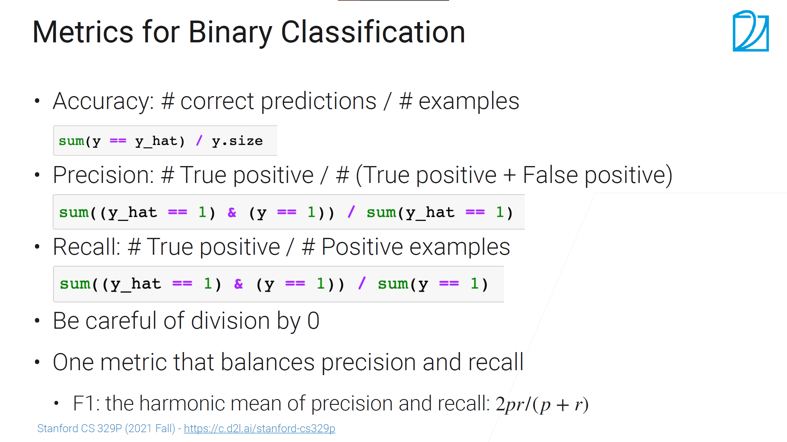
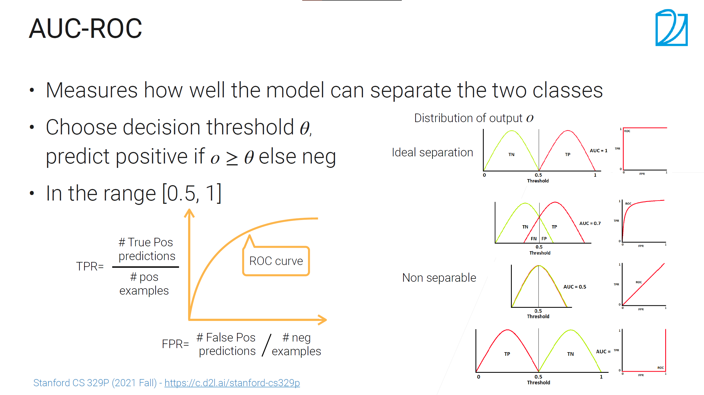

# 模型常用指标

## 简介
* 分类任务 : 评估模型精度
* 目标检测 : map
  
  一般根据多个指标选择模型
---

## 分类指标 Accuracy、Precision、Recall、F1

* Accuracy: 预测正确的样本数量
  * 失效情况：对数据不平衡问题效果不好（极端情况，100个样本1个正样本，全部预测为负类，accuracy=99%）
  * 解决方式，去观察每个类里的Precision和Recall
* Precision: #正确预测为类i/ #预测为类i
  * 失效情况: 模型强置信才预测为i，分子较小但是Precision值较高
  * 解决方式: 用recall去互补
* Recall: #正确预测为类i/ #原样本类i
  * 注意：Recall 和Precision的分子相同
  * 失效情况: 分子固定，通过更多的预测类别i，导致某一类别Recall较高
  * 解决方式: 用Precision去互补
* F1: 平衡Precision和Recall
  * 调和平均: (1/P + 1/R)/2
  * todo：画图观察一下调和平均函数和食用范围

总结：
* Accuracy不考虑模型的具体类别分布，算是总观上指标。
* 对于具体的类别特征，使用P、R、F1来衡量模型预估的准确性
  
 

----

## Roc曲线、Auc面积

AUC衡量的是模型区分正负类的能力。

广告ctr预估是一个二分类问题。不关心绝对的正确率和召回率，通过阈值可以调节，关注模型对两个类别的区分程度。

正负样本比较平衡时阈值可以取0.5，上部分为正类，下部分为负类。阈值theta还可以控制置信区间，提高theta可以提高precision，但是召回率相应下降。

ROC曲线和阈值theta的变化有关

* ROC x轴:  #错误的正预估（实际是负类，错误的预测为正类的数量--类似accuracy） / #原负样本
* ROC y轴： #正确的正预估（实际是正类，预测出的正类数量--正类的recall）/ #原正样本

Auc只反映区分程度，样本相对的排序，不考虑Ctr值的一致性变化，比如所有ctr预估率全体降低0.1不会改变auc值。

----

参考：
    [4.1 模型评估 [李沐实用机器学习]](https://www.bilibili.com/video/BV1tQ4y1S7Ty/?spm_id_from=333.999.0.0&vd_source=6a6b6a073dbbbfefb002d2f74ce51b4d)
