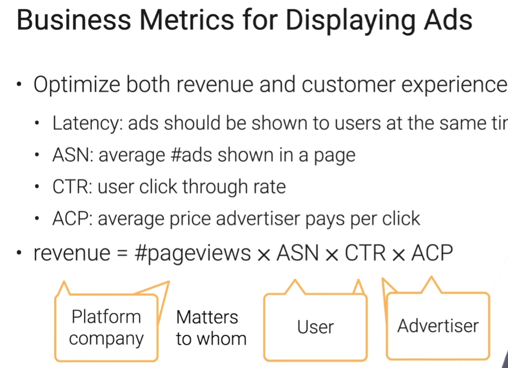

# 商业指标

## 广告展现
优化收入和客户体验
* Latency: 广告展现延迟(300ms)
* ASN: 平均每页展现广告数 average # ads shown in a page
* CTR: 用户点击率 user click through rate
* ACP: 每点击的平均广告收费 average price advertiser pays per click
* 收入 = #Pageviews * ASN * CTR * ACP 

三方博弈

* 平台: 收入(revenue)、用户流量(#pageviews)
* 用户: ASN、CTR
* 广告商: ACP、CTR