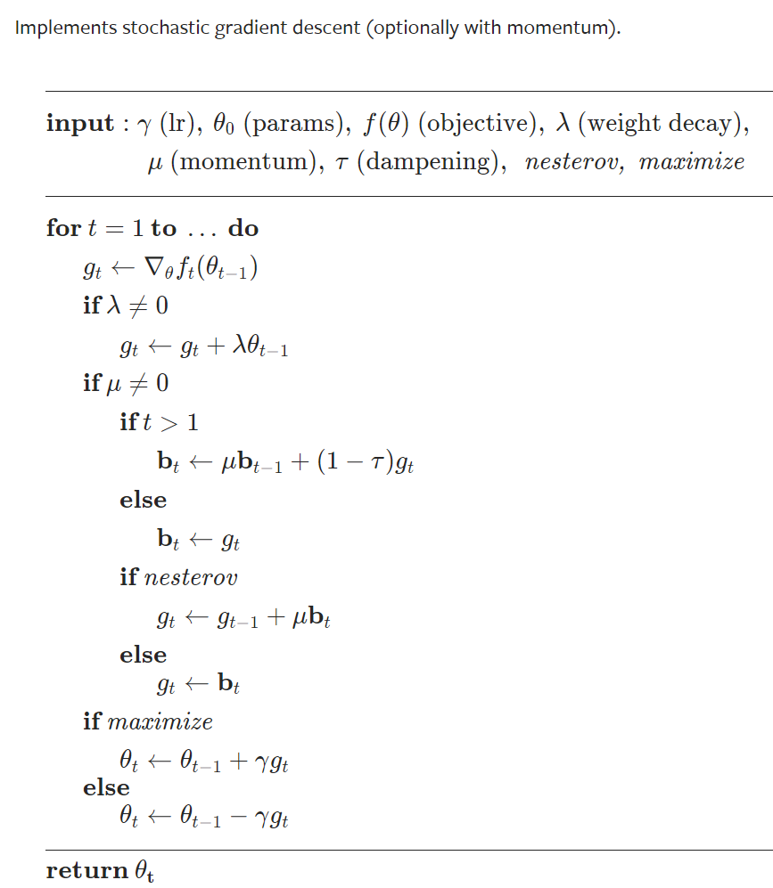
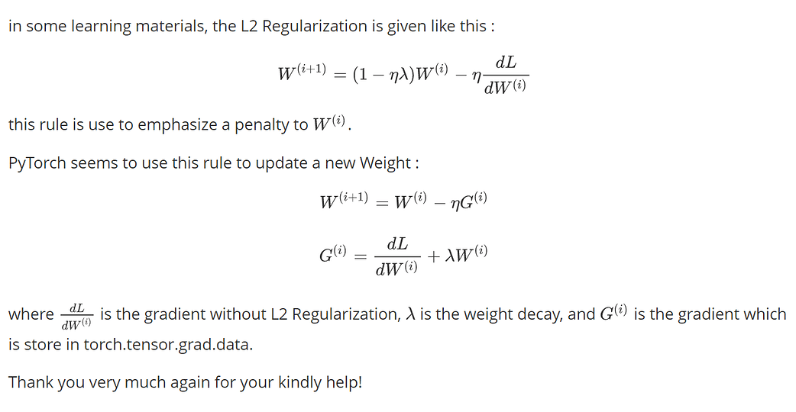
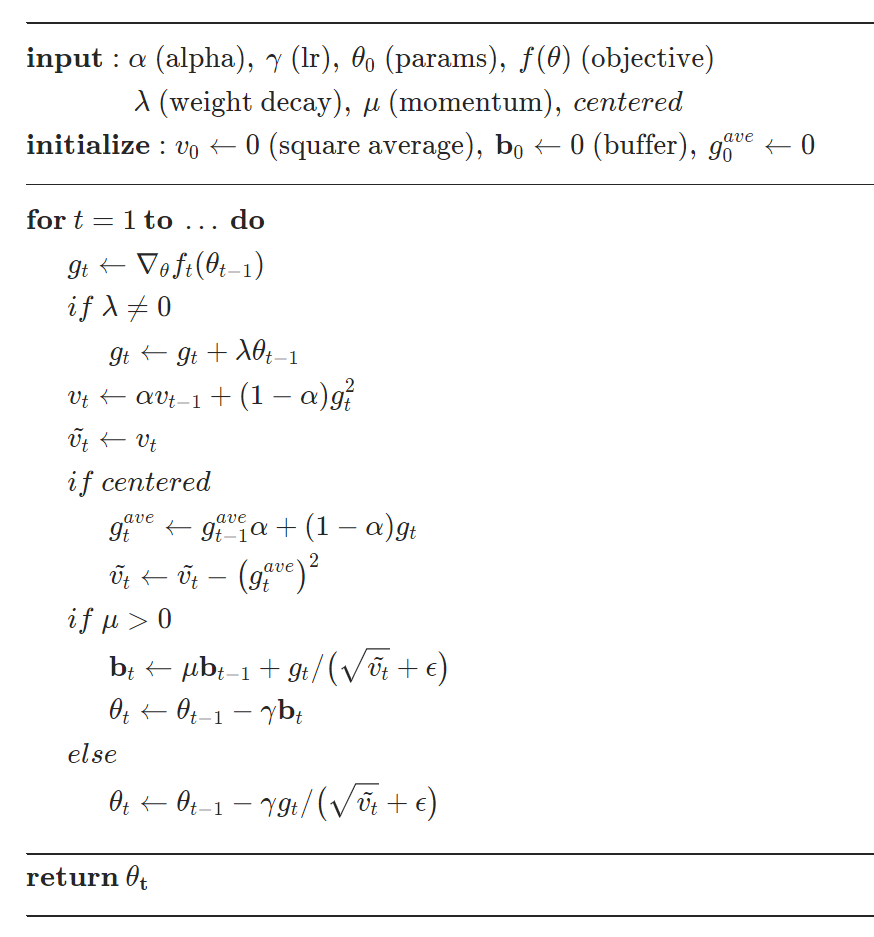
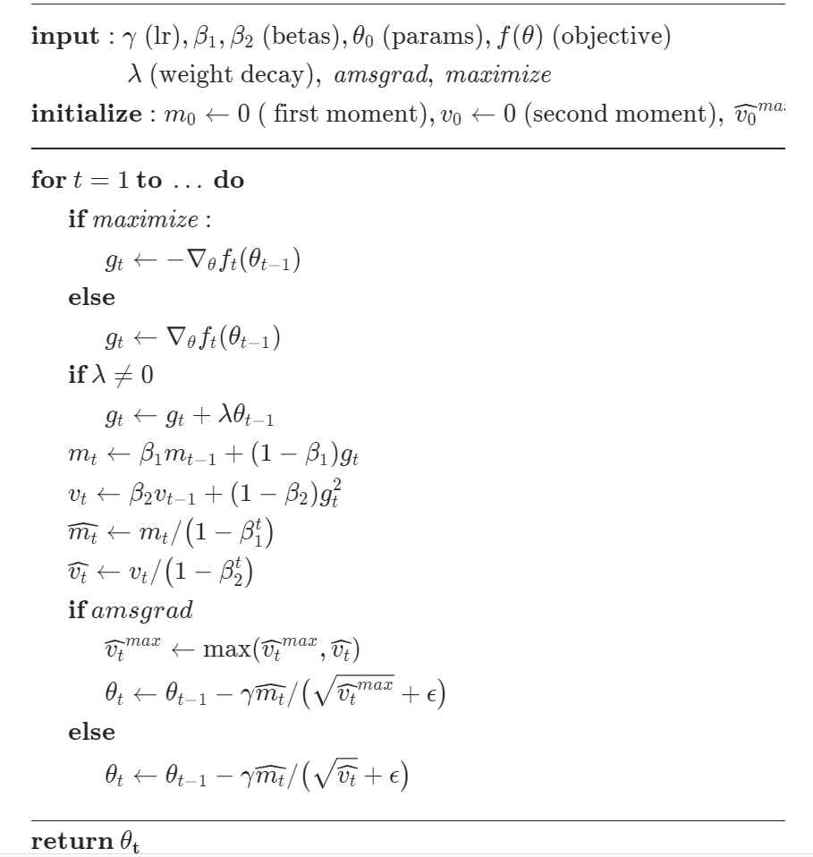
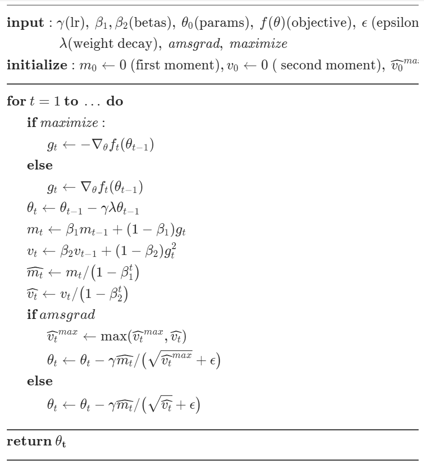

# Pytorch optiom 文档

## [SGD](https://pytorch.org/docs/stable/generated/torch.optim.SGD.html#torch.optim.SGD)

* [`L2正则项的实现讨论`](https://discuss.pytorch.org/t/how-does-sgd-weight-decay-work/33105/7)， lambda 就是l2 正则项前面的系数，推理一下应该就能得出结论（todo）

* Nesterov 打开才有momentum的效果

---
## RMSprop

* 动量的实现，用速度去理解更容易懂
* 最简化的版本和吴恩达教的原理保持一致
* Centered 应该是历史数据去norm化这个vt，物理角度去理解
	
---
## Adam

* 这个原理简单，一看就懂

---
## [ADAMW](https://pytorch.org/docs/stable/generated/torch.optim.AdamW.html#torch.optim.AdamW)

* 和adam不同点  直接对theta进行weight decay，不知道理论依据是啥公式。
* 参考论文 [On the Convergence of Adam and Beyond](https://openreview.net/forum?id=ryQu7f-RZ)
* 不知道有啥用，反正不是大问题，效果好像还不错。

---
## scheduler
[torch.optim.lr_scheduler](https://pytorch.org/docs/stable/optim.html)
* lr_scheduler.OneCycleLR 优化方法里的一种

SWA 不理解，论文下载了以后再说

