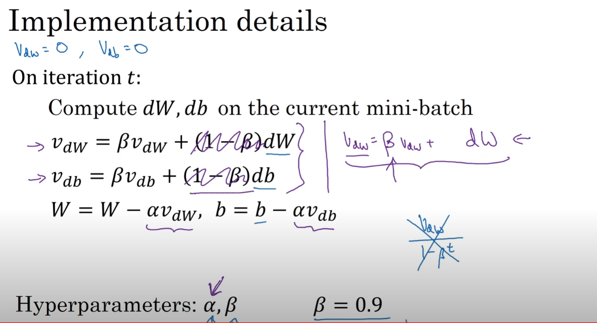
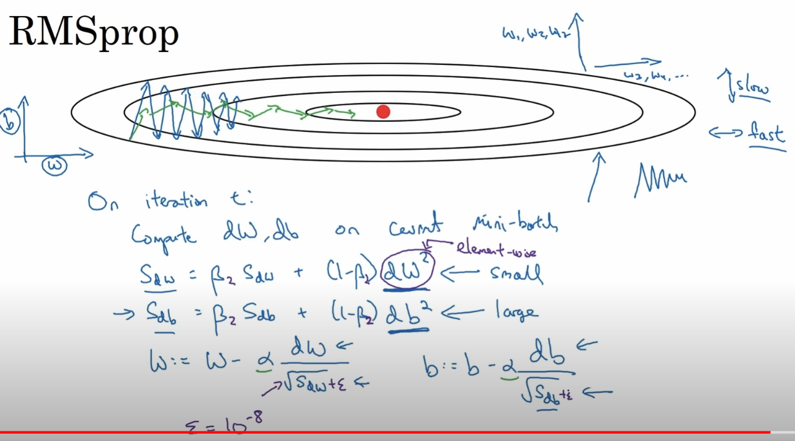
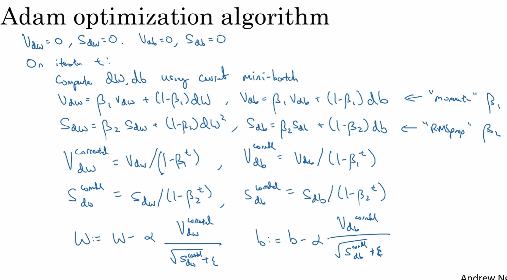
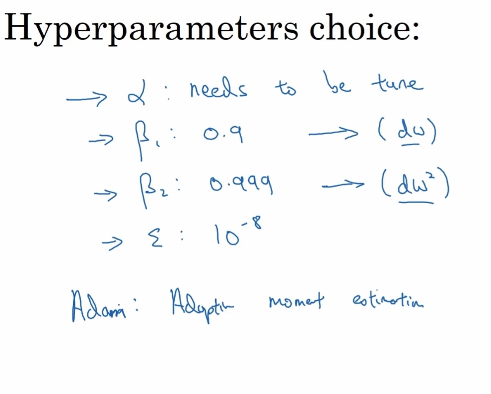

# 梯度优化器原理
	
* [吴恩达视频复习原理](https://www.youtube.com/watch?v=_e-LFe_igno&list=PLkDaE6sCZn6Hn0vK8co82zjQtt3T2Nkqc&index=21&ab_channel=DeepLearningAI)

	
	
## 1. Exponentially weighted averages
    Vt = a* Vt-1 + （1-a）* xt
    近似保留1/(1-a) 天数据的平均数

---
## 2. Momentum 
    就是将梯度曲线平滑化，用平滑后的结果去更新参数。
    1/(1-b) 是平滑的步长

		

---
## 3. RMSprop

	
    1) 计算历史平均速度大小的平方s
    2) 用sqrt(s) norm当前梯度的大小，不改变当前梯度的方向。
    3) 同时保证 量纲一致、符号为正、分母不为0

---	
## 4. Adam

    初始启动项归一化1-b^t , 越往后作用越小。整合momentum和RMSprop，这有啥创新呢？

参数选择

	
    1000步的RMSprop， 10步的momentum，学习率alpha需要调试
	Learning rate decay，学习率衰减。
	总结：学习率是单步步长， 1/(1-beta) 代表平均使用到的历史数据量

