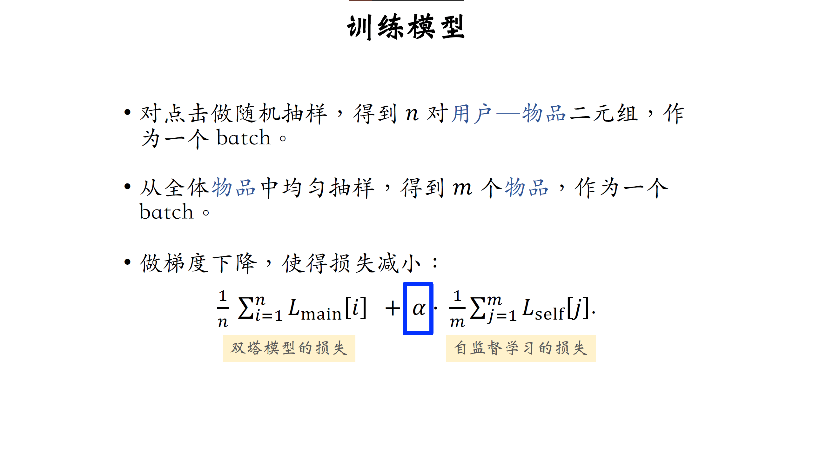

# 双塔模型 (DSSM) 专题

## 模型和训练
## 正负样本
## 线上召回和更新
## 自监督学习
* 双塔模型学不好低曝光物品的向量表征。

* ⾃监督学习：
  * 对物品做随机特征变换。
  * 特征向量𝐛i_1 和𝐛i_2相似度⾼（相同物品）。
  * 特征向量𝐛i_1 和bj_2相似度低（不同物品）。
* 实验效果：低曝光物品、新物品的推荐变得更准。

双塔模型+自监督模型训练物品塔 的协同训练如下：

